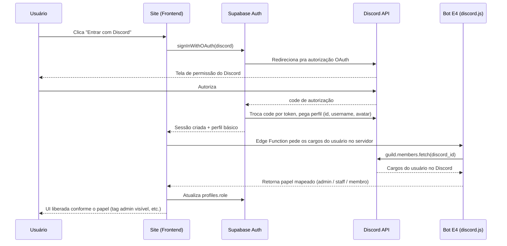

# PRD — Site Elite Four (E4)

> Documento de especificação para implementação no **Cursor**. Cole o prompt da seção 20 como primeira mensagem para o agente começar pela Fase 0.

**Índice:** [1. Contexto](#1-contexto--assets) · [2. Objetivo](#2-objetivo-do-produto) · [3. Métricas](#3-objetivos--métricas-a-acompanhar) · [4. Público](#4-público-alvo) · [5. Sitemap](#5-arquitetura-de-informação-sitemap) · [6. Design System](#6-identidade-visual--design-system) · [7. Stack](#7-stack-técnica) · [8. Auth](#8-autenticação--controle-de-acesso-discord-oauth) · [9. Home](#9-página-home) · [10. Regras](#10-página-de-regras) · [11. Loja](#11-loja) · [12. Admin](#12-painel-admin) · [13. UI Libs](#13-guia-das-bibliotecas-de-ui) · [14. Referências](#14-sites-de-referência--o-que-aproveitar) · [15. Não-funcionais](#15-requisitos-não-funcionais) · [16. Premissas](#16-premissas-assumidas) · [17. Riscos](#17-riscos--pontos-de-atenção) · [18. Fora de escopo](#18-fora-de-escopo-por-enquanto) · [19. Fases](#19-plano-de-execução-em-fases) · [20. Prompt Cursor](#20-prompt-inicial-para-colar-no-cursor)

---

## 1. Contexto & assets

**Servidor:** Elite Four (E4), servidor FiveM de RP temático de Pokémon. Já existem em desenvolvimento (fora do escopo deste PRD, mas relevante como contexto): HUD estilo GBA, tela de inventário, mecânica de arremesso/captura de Pokébola, tela de loading, e um bot de Discord + painel admin de whitelist/tickets em discord.js v14 + Supabase + Vite/React/shadcn. Este documento cobre um projeto novo: o **site público + loja + painel admin** do servidor.

**Assets recebidos** (incluídos na pasta `assets/` junto com este PRD):

| Arquivo | Conteúdo | Uso |
|---|---|---|
| `assets/e4-logo.png` | Silhueta preta de personagem de boné + "E4" em letras douradas facetadas com o "4" em prata metálico, rastro de velocidade abaixo, fundo transparente | Header, favicon, OG image, splash do admin |
| `assets/e4-hero.gif` | Pixel art: personagem numa bicicleta em estrada de terra ao entardecer, céu em gradiente rosa/roxo, silhueta de montanha, grama verde | Hero da Home, com conteúdo sobreposto por cima (texto + CTA) |

**Paleta pedida:** dourado, branco e preto, derivados diretamente do logo (ver seção 6).

---

## 2. Objetivo do produto

Um site que faz três trabalhos:

1. **Apresentar** o servidor pra quem chega de fora (Discord, redes sociais, indicação) — o que é o E4, como entrar, quais são as regras.
2. **Converter** visitantes em compradores na loja — a aba de loja é a principal fonte de receita e precisa ser desenhada com métricas de conversão de e-commerce, não como uma lista estática de produtos.
3. **Dar autonomia ao time** pra manter o conteúdo (regras, banners, destaques da loja) sem depender de deploy novo — via um painel admin liberado automaticamente pra quem tem o cargo certo no Discord.

---

## 3. Objetivos & métricas a acompanhar

Não há baseline ainda, então a recomendação é instrumentar desde o dia 1 (ex: Plausible, PostHog ou GA4) e acompanhar:

- Taxa de conversão visitante → clique em "Ver loja" e visitante → compra concluída
- Taxa de conversão visitante → entrar no Discord (CTA no header/hero)
- Cliques por categoria de loja, pra saber o que priorizar em destaque
- Tempo até a primeira compra de um usuário recém-logado
- Quantas edições de conteúdo (regras, banners, destaques) o admin faz por semana — indicador de que o painel realmente substitui pedir deploy pro dev

---

## 4. Público-alvo

Jogadores de FiveM RP no Brasil, interessados em Pokémon/RP, chegando majoritariamente via link do Discord ou redes sociais. Acesso predominantemente por **celular** (padrão comum em comunidades de FiveM que vivem dentro do Discord) — a Home e a Loja precisam ser desenhadas mobile-first, não como adaptação de uma versão desktop.

---

## 5. Arquitetura de informação (sitemap)

```
/                        Home (hero animado, destaques, resumo de regras, CTA loja + Discord)
/regras                  Regras completas, por categoria
/loja                    Loja — grid de categorias
/loja/categoria/:slug    Categoria — lista de pacotes
/loja/carrinho           Carrinho / checkout (Tebex.js inline, sem sair do site)
/perfil                  Perfil do jogador logado via Discord + histórico de compra
/admin                   Painel admin (liberado por cargo do Discord)
  /admin/conteudo          Home, banners, anúncios
  /admin/regras            Editor de regras
  /admin/loja               Curadoria de destaques da loja + atalho pro painel da Tebex
  /admin/depoimentos       Curadoria de depoimentos
  /admin/usuarios          Visualização de cargos sincronizados do Discord
/auth/discord/callback    Callback técnico do OAuth (não aparece na navegação)
```

---

## 6. Identidade visual / Design system

A referência já está definida pelo logo e pelo hero — a ideia aqui é sistematizar isso, não inventar uma direção nova. Evitar o visual "genérico de IA" (fundo bege + serifada, ou preto + verde-neon) e evitar também copiar o template padrão dos concorrentes (ver seção 14) — o pixel art + o dourado facetado do logo já são um diferencial visual real.

**Cores** (CSS custom properties, prontas pro `tailwind.config`):

```css
:root {
  /* Base */
  --e4-black:      #0B0B0D; /* fundo principal */
  --e4-black-soft: #16161A; /* cards, superfícies elevadas */
  --e4-white:      #F7F6F2; /* texto sobre fundo escuro */

  /* Marca (do logo) */
  --e4-gold:       #F2B705; /* dourado primário — CTAs, links, ícones, foco */
  --e4-gold-deep:  #B8860B; /* dourado escuro — gradientes, hover, bordas */
  --e4-silver:     #D8DCE3; /* prata do "4" — texto secundário, ícones */

  /* Acento (do hero) — uso pontual, nunca como cor dominante */
  --e4-dusk:       #E8734A; /* coral do pôr do sol — glows e hovers raros */
}
```

**Tipografia** (2+ papéis, deliberadamente ligada à estética gamer/retro em vez de fontes neutras):

| Papel | Fonte | Uso |
|---|---|---|
| Display | **Rajdhani** (600/700) | Headline do hero, títulos de seção, nomes de categoria |
| Corpo | **Inter** | Parágrafos, regras, qualquer texto longo — prioriza legibilidade |
| Dados | **JetBrains Mono** | Preços, contadores, timers de promoção relâmpago |
| Acento | **Press Start 2P** | Só em selos pequenos ("NOVO", "LIMITADO") — nunca em blocos de texto, pixel font cansa a leitura em tamanho grande |

**Layout & elemento-assinatura:**

- O hero da Home usa `e4-hero.gif` (ou a versão convertida — ver seção 17) em full-bleed, com um gradiente escuro na base pra garantir contraste do texto sobreposto (headline + subtítulo + dois CTAs: "Entrar no servidor" e "Ver loja").
- Divisores entre seções: em vez de linha reta, usar um corte diagonal facetado (clip-path) ecoando o corte das letras "E4" do logo — um detalhe estrutural pequeno, mas recorrente, que reforça a identidade em vez de decorar à toa.
- Cards de produto e de categoria usam o `--e4-black-soft` com borda `--e4-gold-deep` de 1px e glow sutil de `--e4-gold` só no hover (não estático — motion com propósito, não decoração espalhada).

---

## 7. Stack técnica

Mantendo consistência com o que já existe no projeto (bot + painel admin de whitelist já usam Vite/React/shadcn/Supabase/Easypanel):

| Camada | Escolha | Por quê |
|---|---|---|
| Frontend | Vite + React + TypeScript + Tailwind | Mesmo padrão do painel admin já especificado |
| Componentes | shadcn/ui (base) + SmoothUI + Unlumen UI | As duas libs pedidas são compatíveis com a CLI do shadcn — instalam por cima da mesma base, sem conflito |
| Auth & DB | Supabase (Postgres + Auth + Edge Functions) | Reaproveita o Supabase já usado no bot/painel |
| Cargos do Discord | Bot já existente (discord.js v14) | Evita pedir escopo OAuth extra do usuário — o bot já tem acesso aos membros do servidor |
| Loja / pagamento | Tebex (Headless API) | Ver decisão detalhada na seção 11 |
| Hospedagem | Docker via EasyPanel, na VPS Hostinger já em uso | Mesmo ambiente dos outros projetos, sem infra nova pra manter |
| Monorepo | pnpm workspace (se o site for viver junto do painel de whitelist) ou repo próprio | A definir conforme preferência — ambos funcionam com a stack acima |

---

## 8. Autenticação & controle de acesso (Discord OAuth)

Login único via Discord. Não existe fluxo de "esqueci minha senha" — recuperação de acesso é 100% via Discord.



**Schema (Supabase/Postgres):**

```sql
create table profiles (
  id uuid primary key references auth.users(id) on delete cascade,
  discord_id text unique not null,
  username text not null,
  avatar_url text,
  role text not null default 'member' check (role in ('member','staff','admin')),
  created_at timestamptz not null default now(),
  updated_at timestamptz not null default now()
);
```

**Mapeamento de cargo:** um cargo específico do Discord (ex: `@Admin`) → `role = 'admin'`; outro (ex: `@Staff`) → `role = 'staff'`; sem nenhum dos dois → `role = 'member'`. Os IDs dos cargos do Discord ficam em variável de ambiente, não hardcoded. RLS do Supabase: só `role = 'admin'` pode escrever nas tabelas de conteúdo (`site_content`, `rules_sections`, `featured_items`); leitura é pública.

---

## 9. Página Home

- **Hero:** `e4-hero.gif` full-bleed (ver nota de performance na seção 17), headline + subtítulo + CTAs sobrepostos ("Entrar no servidor" → Discord, "Ver loja" → `/loja`).
- **Destaques do servidor:** números animados (Count Up) — membros no Discord, itens vendidos, etc. — o que houver de dado real disponível.
- **Regras resumidas:** 3-4 pontos principais + link para `/regras` completo.
- **Prévia da loja:** 2-3 categorias ou itens em destaque (vem da curadoria do admin, seção 11).
- **Depoimentos:** carrossel (Infinite Slider) — puxando das reviews nativas da Tebex se possível, ou da tabela de curadoria própria.
- **Footer:** links de Discord/Instagram/TikTok, termos, e-mail de contato.

---

## 10. Página de Regras

- Conteúdo editável via `/admin/regras`, armazenado como markdown em `rules_sections` (uma linha por seção: Geral, RP, PVP, Loja/Compras etc., com `display_order`).
- Navegação lateral (ou tabs no mobile) por seção, âncoras internas.
- Texto em `--e4-white` sobre `--e4-black-soft` — aqui a legibilidade importa mais que o estilo, por isso corpo em Inter, sem fonte pixelada.

---

## 11. Loja

### Decisão de arquitetura: Tebex Headless API (recomendado)

Os três sites de referência enviados (ztk.gg, proleague.com.br, foguete.gg) **usam Tebex** como motor de loja e pagamento — os três têm o aviso padrão *"This website and its checkout process is owned & operated by Tebex Limited"* no rodapé. Isso não é coincidência: é o padrão de facto do mercado de lojas de servidor FiveM.

| | **Opção A — Tebex Headless (recomendado)** | **Opção B — 100% customizado** |
|---|---|---|
| Catálogo (itens/categorias/separações) | Gerenciado no painel da Tebex (Creator Panel) — exatamente o CRUD que foi pedido, sem construir do zero | Precisa construir CRUD completo + banco próprio |
| Pagamento | Tebex é Merchant of Record: cartão, PayPal, cripto, e métodos locais do Brasil (Boleto Bancário e Bradesco confirmados — ver seção 17 sobre Pix) | Precisa integrar gateway (Mercado Pago/Stripe), tratar chargeback, compliance PCI |
| Entrega in-game | Plugin da Tebex no servidor (comandos executados a cada poucos minutos) ou webhook próprio | Construir webhook + lógica de entrega do zero |
| Front-end | 100% customizado — a Tebex só fornece dados via API, o visual é todo seu (Tebex.js só cuida do checkout inline) | 100% customizado |
| Esforço de implementação | Baixo/médio | Alto |

**Como funciona na prática:** o front-end consome a Headless API da Tebex (`headless.tebex.io/api/accounts/{token}/...`) pra listar categorias e pacotes, cria um "basket" e usa **Tebex.js** para o checkout acontecer embutido no próprio site (o usuário não é redirecionado pra um domínio externo). O catálogo (preço, estoque, descrição) é gerenciado pelo time direto no painel da Tebex — que já resolve o "adicionar item / adicionar categoria" pedido, sem esforço extra de dev. Referência oficial: `docs.tebex.io/developers/headless-api`, template oficial `tebexio/Headless-Template`, SDK Node/TS da comunidade `tebex_headless`.

Se no futuro fizer sentido ter controle 100% custom do catálogo (ex: preços dinâmicos, estoque ligado a outro sistema), existe também a **Tebex Checkout API** — mais avançada, exige aprovação prévia da Tebex, e vale como Fase 2 do produto, não como ponto de partida.

### Camada de curadoria (sobre o catálogo da Tebex)

Pra dar ao admin controle de destaque/organização no site sem duplicar o catálogo:

```sql
create table featured_items (
  id uuid primary key default gen_random_uuid(),
  tebex_package_id text not null,
  custom_badge text,        -- ex: "MAIS VENDIDO", "NOVO"
  category_override text,   -- agrupamento customizado (a "separação" pedida)
  display_order int not null default 0,
  is_active boolean not null default true
);
```

### Features de conversão a implementar

Com base nos três sites de referência + boas práticas de e-commerce:

- Barra de cupom/promoção fixa no topo, com contador regressivo pra ofertas relâmpago
- Cards de categoria com ícone + nome, sempre visíveis (padrão dos 3 concorrentes: VIP, veículos, armas/skins, combos, itens limitados)
- Carrinho sempre visível com valor total, sem precisar abrir pra ver que tem algo nele
- Depoimentos reais (nome + data + item comprado) — a Tebex já fornece isso nativamente
- Bundles/combos com preço "de/por" mostrando o desconto
- Selo de urgência/escassez em itens limitados ("LIMITADO", "TEMPORÁRIO")
- Considerar (opcional): leaderboard de maiores compradores, como o proleague.com.br faz — gamifica o gasto, mas avaliar se combina com o tom da comunidade E4 antes de implementar

---

## 12. Painel Admin

Liberado automaticamente pra `role = 'admin'` (seção 8). Seções:

- **Conteúdo:** editar hero (headline/subtítulo/CTA), banners, anúncios da home
- **Regras:** editor markdown por seção (`rules_sections`)
- **Loja:** curadoria de destaques (`featured_items`) + atalho direto pro Creator Panel da Tebex, onde o catálogo em si é gerenciado
- **Depoimentos:** curar quais aparecem no carrossel da home, se não vierem 100% automático da Tebex
- **Usuários:** visualização (read-only) dos perfis e cargos sincronizados do Discord — útil pra debugar se alguém não está vendo a tag de admin

---

## 13. Guia das bibliotecas de UI

Ambas (SmoothUI e Unlumen UI) são React + Tailwind + Motion, compatíveis com a CLI do shadcn — instalam como componentes adicionais por cima da base do shadcn, sem conflito.

| Elemento do site | Componente | Biblioteca |
|---|---|---|
| Números animados (membros, vendas) | Count Up | Unlumen |
| CTA principal ("Ver loja", "Entrar no Discord") | Glow Button / Magnetic Button | Unlumen |
| Cards de produto na loja | Tilt Card | Unlumen |
| Selo "MAIS VENDIDO" / "LIMITADO" | Glowing Badge | Unlumen |
| Skeleton de loading da loja | Shimmer Skeleton | Unlumen |
| Headline do hero | Text Reveal | Unlumen |
| Busca rápida no painel admin | Command Menu (⌘K) | Unlumen |
| Carrossel de depoimentos | Infinite Slider | SmoothUI |
| Alternância de tema claro/escuro | Theme Switch | Unlumen |
| Tooltip de termos/regras | Floating Tooltip | Unlumen |

Usar com moderação — um momento orquestrado (o hero, por exemplo) pesa mais do que várias micro-animações espalhadas. Nem todo componente das duas libs precisa entrar no site.

---

## 14. Sites de referência — o que aproveitar

Todos os três (ztk.gg, proleague.com.br, foguete.gg) rodam sobre Tebex e têm uma estrutura muito parecida entre si — o que confirma a escolha da seção 11, mas também é a oportunidade do E4: como os concorrentes têm cara de "template padrão da Tebex", a estética pixel art + logo dourado/prata do E4 já é, por si só, um diferencial visual real, então vale resistir à tentação de deixar o site parecido com os deles.

**Padrões que valem a pena reaproveitar:** barra de cupom fixa no topo; categorias como pills clicáveis; carrinho com total sempre visível; depoimentos reais com nome, data e item comprado; links de Discord/redes tanto no topo quanto no rodapé.

**Diferencial do proleague.com.br:** leaderboard público dos maiores compradores do mês (com medalhas) — mencionado como opcional na seção 11.

---

## 15. Requisitos não-funcionais

- **Mobile-first:** maioria do tráfego chega via link do Discord no celular
- **Performance:** hero não pode travar o carregamento inicial (ver seção 17 sobre o GIF)
- **SEO básico:** meta tags, OG image usando o logo, sitemap.xml
- **Acessibilidade:** contraste AA mínimo (o texto sobre `--e4-black` já foi pensado pra isso), foco visível em todos os elementos interativos, `prefers-reduced-motion` respeitado nas animações das duas libs de UI
- **Segurança:** nenhuma chave privada da Tebex ou do bot do Discord no client — tudo via Edge Function/backend; RLS ativo em todas as tabelas do Supabase

---

## 16. Premissas assumidas

Pra não travar o início da implementação, este PRD assume:

- A loja vende produtos digitais consumíveis dentro do jogo (VIP/ranks, veículos, cosméticos, moedas) — não produtos físicos
- "Separação", no pedido original, foi interpretado como subcategoria/agrupamento dentro de uma categoria da loja (campo `category_override` na seção 11) — ajustar se o significado pretendido for outro
- O catálogo de produtos vive na Tebex; o admin do site cura/destaca, não recria esse CRUD (a Opção B da seção 11 fica registrada como alternativa)
- Domínio próprio ainda não definido — o plano assume que um domínio será registrado antes do deploy final
- Hospedagem segue o padrão já usado nos outros projetos (Docker + EasyPanel na VPS já existente)

---

## 17. Riscos & pontos de atenção

- **Entrega in-game:** pacotes vendidos via Tebex normalmente entregam através de um plugin que roda comandos no servidor a cada poucos minutos — confirmar se o servidor Lua do E4 já tem esse plugin instalado; se não tiver, isso entra no escopo do time do servidor de jogo, não deste site.
- **Pix:** a Tebex já suporta métodos específicos do Brasil (Boleto Bancário e Bradesco confirmados na documentação oficial). Suporte a Pix especificamente não foi confirmado — checar diretamente em Payments > Payment Methods no painel da Tebex antes do lançamento, já que a lista de métodos muda com o tempo.
- **Loot boxes:** se o E4 quiser um mecanismo de "abrir caixa" como os concorrentes têm, vale checar a regulamentação brasileira sobre esse tipo de mecânica antes de implementar, já que é uma área com regras em evolução.
- **Performance do GIF:** o `e4-hero.gif` deve ser convertido pra `.webm`/`.mp4` com poster estático como fallback — GIF é pesado e não é a melhor opção pra um hero full-bleed em produção, mesmo mantendo o visual idêntico.
- **Permissões do bot:** a sincronização de cargos (seção 8) depende do bot do Discord já existente estar no servidor com permissão de leitura de membros — confirmar isso antes de começar a Fase 1.

---

## 18. Fora de escopo (por enquanto)

- Sistema de suporte/tickets no site (o bot já cobre isso separadamente)
- App mobile nativo
- Multi-idioma (site em português apenas, por ora)
- Programa de afiliados/cupom por indicação

---

## 19. Plano de execução em fases

**Fase 0 — Fundação**
Setup do repo (Vite + React + TS + Tailwind); instalar shadcn/ui e depois SmoothUI + Unlumen UI; configurar os tokens da seção 6 no `tailwind.config`; esqueleto de deploy no EasyPanel.
✅ *Checkpoint:* build local roda, deploy placeholder acessível na VPS.

**Fase 1 — Auth & papéis**
Supabase Auth com provider Discord; Edge Function que consulta o bot pra pegar cargos e grava `profiles.role`; tag de admin visível na UI.
✅ *Checkpoint:* login funciona ponta a ponta; usuário com cargo de admin no Discord vê a tag de admin no site.

**Fase 2 — Home**
Hero com `e4-hero.gif`/vídeo convertido + overlay; destaques (Count Up); resumo de regras; carrossel de depoimentos.
✅ *Checkpoint:* home publicada, responsiva, hero carrega rápido.

**Fase 3 — Regras**
Editor de regras no admin + página pública renderizando o conteúdo.
✅ *Checkpoint:* admin edita uma regra e a mudança aparece na página pública sem novo deploy.

**Fase 4 — Loja**
Integração com a Tebex Headless API (categorias, baskets, checkout inline via Tebex.js); camada de curadoria (`featured_items`); elementos de conversão da seção 11.
✅ *Checkpoint:* uma compra de teste completa o fluxo ponta a ponta.

**Fase 5 — Painel Admin**
CRUD de conteúdo, curadoria da loja, curadoria de depoimentos, visualização de usuários/cargos.
✅ *Checkpoint:* admin troca o banner da home e destaca/remove um item da loja sem tocar em código.

**Fase 6 — Polimento & conversão**
Micro-interações das duas libs de UI; SEO básico; analytics; ajuste fino de responsividade mobile.
✅ *Checkpoint:* Lighthouse mobile acima de 90 em performance/acessibilidade nas páginas principais.

**Fase 7 — QA & lançamento**
Revisão de conteúdo com o time; checklist de segurança (RLS, secrets fora do client); domínio final apontando pra produção.
✅ *Checkpoint:* checklist de lançamento 100% marcado.

---

## 20. Prompt inicial para colar no Cursor

```
Este repositório vai implementar o PRD-Elite-Four-Site.md que está na raiz do
projeto (leia o arquivo inteiro antes de começar, incluindo a pasta assets/).

Comece pela Fase 0 (seção 19): estruture o projeto em Vite + React +
TypeScript + Tailwind, instale shadcn/ui como base e depois SmoothUI e
Unlumen UI por cima (ambos compatíveis com a CLI do shadcn), e configure os
tokens de cor e tipografia da seção 6 no tailwind.config.

Não avance pra próxima fase sem eu confirmar que a fase atual está ok. Ao
final de cada fase, pare, liste o que foi feito, o que falta, e qualquer
decisão da seção 16 (Premissas) que precisou ser revista.
```
