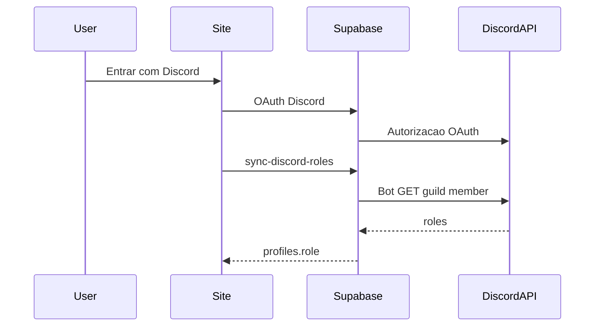

# Guia — Bot Discord Elite Four (E4)

Passo a passo para criar a **Discord Application** usada pelo site E4: login OAuth (Supabase) e leitura de cargos (Edge Function `sync-discord-roles`).

Uma única Application cobre os dois usos. **Não é necessário** manter um processo Node/discord.js ligado 24/7 só para sync de cargos — o site usa o **token do bot** na API REST do Discord.

Guia ligado ao projeto Supabase `site` (`dppyamtmjzmmkzjlmiew`).

---

## Pré-requisitos

- Conta com permissão de **administrador** no servidor Discord da Elite Four
- Acesso ao [Discord Developer Portal](https://discord.com/developers/applications)
- Acesso ao [Supabase Dashboard](https://supabase.com/dashboard) do projeto `site`
- Site local ou deploy com `.env` apontando para esse projeto

---

## Como funciona (visão geral)



| Peça | Função |
|---|---|
| OAuth2 (Client ID + Secret) | Login no site via Supabase Auth |
| Bot Token | Edge Function busca o membro no guild e lê os cargos |
| Role IDs Admin / Staff | Mapeiam para `profiles.role` = `admin` / `staff` |

Mapeamento no código:

- Tem cargo **Admin** → `admin`
- Senão, tem cargo **Staff** → `staff`
- Nenhum dos dois → `member`

---

## 1. Criar a Application

1. Abra [discord.com/developers/applications](https://discord.com/developers/applications).
2. Clique em **New Application**.
3. Nome sugerido: `Elite Four Site` (ou `E4 Auth`).
4. Aceite os termos e confirme.
5. Em **General Information**, opcionalmente envie o ícone com o logo E4 (`assets/e4-logo.png`).

---

## 2. Criar o Bot e copiar o token

1. No menu lateral: **Bot**.
2. Clique em **Add Bot** / **Reset Token** se ainda não existir.
3. Em **Token**, clique em **Reset Token** → confirme → **Copy**.
4. Guarde como `DISCORD_BOT_TOKEN`.

**Nunca** coloque o bot token no `.env` do frontend (`VITE_*`), no Git ou em chat público. Só em **Supabase → Edge Functions → Secrets**.

Opções úteis na tela Bot:

- **Public Bot**: pode ficar ligado se for convidar só no servidor E4
- **Requires OAuth2 Code Grant**: deixar **desligado**

---

## 3. Privileged Gateway Intents

Na mesma página **Bot**, em **Privileged Gateway Intents**:

| Intent | Site E4 |
|---|---|
| **Server Members Intent** | **Ligado** (obrigatório para ler membros/cargos) |
| Presence Intent | Desligado |
| Message Content Intent | Desligado |

Salve as alterações (**Save Changes**).

> Sem Server Members Intent, a API costuma falhar ao buscar o membro no guild (403/erro), e o sync de cargos não funciona.

---

## 4. OAuth2 — login do site

1. Menu lateral: **OAuth2** → **General**.
2. Em **Redirects**, adicione:

   | URL | Uso |
   |---|---|
   | `https://dppyamtmjzmmkzjlmiew.supabase.co/auth/v1/callback` | Produção / Auth do Supabase (obrigatório) |
   | `http://localhost:54321/auth/v1/callback` | Só se usar Supabase CLI local (opcional) |

3. **Save Changes**.
4. Copie:
   - **Client ID**
   - **Client Secret** (Reset Secret se precisar)

### Configurar no Supabase

1. Dashboard do projeto → **Authentication** → **Providers** → **Discord**.
2. Ative **Discord Enabled**.
3. Cole **Client ID** e **Client Secret**.
4. Salve.

### Redirect allow list (Auth)

Em **Authentication** → **URL Configuration** (ou Redirect URLs), inclua:

- `http://localhost:5173/auth/discord/callback` (dev Vite)
- URL de produção depois, no mesmo formato: `https://SEU-DOMINIO/auth/discord/callback`

O site chama OAuth com scopes `identify` e `email`.

---

## 5. Convidar o bot ao servidor E4

1. Em **OAuth2** → **URL Generator**.
2. **Scopes**: marque só `bot`.
3. **Bot Permissions** (mínimo para o site):

   - `View Channels`
   - Permissão de ver membros do servidor (na UI do Discord costuma aparecer como parte de leitura de membros / não precisa de Administrator)

   Evite marcar **Administrator** só por comodidade.

4. Copie a URL gerada, abra no navegador, escolha o **servidor Elite Four** e autorize.
5. Confirme que o bot aparece na lista de membros do servidor.

O bot **não precisa estar “online”** (Gateway) para a Edge Function funcionar: o token basta para a REST API. Se no futuro houver um processo discord.js, aí sim ele ficará online — para o site, estar **no servidor** é o essencial.

---

## 6. Coletar IDs (modo desenvolvedor)

No Discord (app desktop ou web):

1. **Configurações do usuário** → **Avançado** → ative **Modo desenvolvedor**.
2. Colete:

| Secret | Como obter |
|---|---|
| `DISCORD_GUILD_ID` | Clique direito no **ícone do servidor** → **Copiar ID do servidor** |
| `DISCORD_ADMIN_ROLE_ID` | **Configurações do servidor** → **Cargos** → clique direito no cargo Admin → **Copiar ID** |
| `DISCORD_STAFF_ROLE_ID` | Idem para o cargo Staff |

Use os cargos reais da hierarquia E4 (ex.: `@Admin`, `@Staff`). Os nomes não importam — só os **IDs**.

---

## 7. Secrets na Edge Function

No Supabase Dashboard → **Edge Functions** → **Secrets** (ou Project Settings → Edge Functions), defina:

| Secret | Valor |
|---|---|
| `DISCORD_BOT_TOKEN` | Token do passo 2 |
| `DISCORD_GUILD_ID` | ID do servidor |
| `DISCORD_ADMIN_ROLE_ID` | ID do cargo admin |
| `DISCORD_STAFF_ROLE_ID` | ID do cargo staff |

`SUPABASE_URL`, `SUPABASE_ANON_KEY` e `SUPABASE_SERVICE_ROLE_KEY` já são injetados no runtime das functions — não precisa repetir para o sync funcionar.

A function implantada no projeto é: **`sync-discord-roles`**.

---

## 8. Frontend (lembrete)

No `.env` do site (valores públicos):

```env
VITE_SUPABASE_URL=https://dppyamtmjzmmkzjlmiew.supabase.co
VITE_SUPABASE_ANON_KEY=<anon key do projeto>
VITE_DISCORD_INVITE_URL=https://discord.gg/<seu-invite>
```

Não coloque bot token nem Client Secret aqui.

---

## 9. Checklist de teste

- [ ] Bot aparece na lista de membros do servidor E4
- [ ] Provider Discord ativo no Supabase com Client ID/Secret corretos
- [ ] Redirect Supabase callback + allow list `.../auth/discord/callback` configurados
- [ ] Quatro secrets da Edge Function preenchidos
- [ ] `pnpm dev` → **Entrar** / **Entrar com Discord**
- [ ] Após login, `/perfil` mostra username, avatar e Discord ID
- [ ] Conta com cargo Admin → badge **ADMIN** no header/perfil e acesso a `/admin`
- [ ] Conta só Staff → badge **STAFF**, sem acesso a `/admin`
- [ ] Conta sem esses cargos → **MEMBRO**
- [ ] Botão **Atualizar cargos** no perfil refresca o `role` após mudar cargo no Discord

---

## 10. Troubleshooting

| Sintoma | Causa provável | O que fazer |
|---|---|---|
| Login abre Discord e volta sem sessão | Redirect / allow list / provider | Conferir callback Supabase, Client Secret e URL `.../auth/discord/callback` |
| Perfil sem sync / mensagem de bot env | Secrets faltando | Preencher `DISCORD_BOT_TOKEN` e `DISCORD_GUILD_ID` |
| Role sempre `member` com nota “not in guild” | Usuário ou bot fora do servidor / guild ID errado | Entrar no guild; conferir `DISCORD_GUILD_ID` |
| 403 / 502 na sync | Token inválido, intent off, bot sem acesso | Reset token; ligar Server Members Intent; reconvidar o bot |
| Role sempre `member` mesmo sendo Admin | Role ID errado | Recopiar ID do cargo; confirmar que o usuário tem esse cargo |
| Badge admin some após logout/login | Cache / sync falhou | Usar **Atualizar cargos**; checar logs da function no Supabase |

Logs: Dashboard → **Edge Functions** → `sync-discord-roles` → Logs.

---

## Segurança

- Token do bot e Client Secret = **somente** secrets / painel Supabase Auth
- Não commitar `.env` com secrets
- Se o token vazar: **Reset Token** no Developer Portal e atualize o secret no Supabase
- Prefira permissões mínimas no invite do bot (sem Administrator)

---

## Fora deste guia

- Bot de **tickets / whitelist** (outro projeto, discord.js)
- Hospedagem 24/7 de um processo Node — não exigida pelo sync atual do site
- Loja Stripe (Fase 4) — ver `docs/stripe-store-setup.md`

---

## Referências

- [Login with Discord (Supabase)](https://supabase.com/docs/guides/auth/social-login/auth-discord)
- [Discord Developer Portal](https://discord.com/developers/applications)
- Código de sync: [`supabase/functions/sync-discord-roles/index.ts`](../supabase/functions/sync-discord-roles/index.ts)
- PRD: [`PRD-Elite-Four-Site.md`](../PRD-Elite-Four-Site.md) (seção 8)
